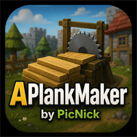

# APlankMaker

APlankMaker is a DreamBot plank-production script by PicNick.

## Modes

- **Simple:** uses owned supplies, selects the highest supported log tier, and chooses an accessible sawmill route automatically.
- **Advanced:** provides manual log, sawmill, transport, equipment, restock, selling, and runtime controls.
- **Lunar Plank Make [Experimental]:** runs a separate Lunar spell workflow with rune, staff, rune-pouch, bank-position, optional restock, altar switching, and optional safe-world hopping controls.

## Public Release

- **Current public release:** v1.2
- **Jar:** `releases/AI-Plank-Maker-DreamBot-Public.jar`
- **DreamBot script name:** `APlankMaker`
- **DreamBot script module:** `PicNickScripts`
- **SDN Parameters:** `APlankMaker`
- **Java compatibility:** Java 8 bytecode; source validated with `javac --release 8` for SDN compatibility.
- **QuickStart:** No
- **Ironman supported:** Yes. Ironman mode disables Grand Exchange restocking and selling.

## Features

- Simple and Advanced sawmill workflows are the primary production modes.
- Auburnvale, Prifddinas, Woodcutting Guild, and Varrock sawmill routing are supported.
- Owned-supply processing, humanized mouse and idle behavior, breaks, and optional equipment setup are included.
- GE restocking and selling are optional experimental features.
- Lunar Plank Make, Lunar altar switching, and Lunar world hopping are optional experimental features.

## Installation For Local Testing

1. Download `releases/AI-Plank-Maker-DreamBot-Public.jar`.
2. Place it in the DreamBot `Scripts` directory.
3. Refresh DreamBot Local Scripts.
4. Start `APlankMaker`.

## Source And SDN

This public repository intentionally ships the compiled release jar, SDN submission notes, icon asset, notice, and checksum only. The proprietary source is not distributed here.

DreamBot SDN submission uses the repository/module fields provided in the DreamBot Scripter Panel. Use the private DreamBot-hosted source repository/module for SDN compile, not this public GitHub repository.

## User Guide

Public setup and settings documentation is available in [`docs/Home.md`](docs/Home.md). If GitHub Wiki is enabled for this repository later, these same pages can be published there.

## Verification

See `SHA256SUMS.txt` for the release checksum.
